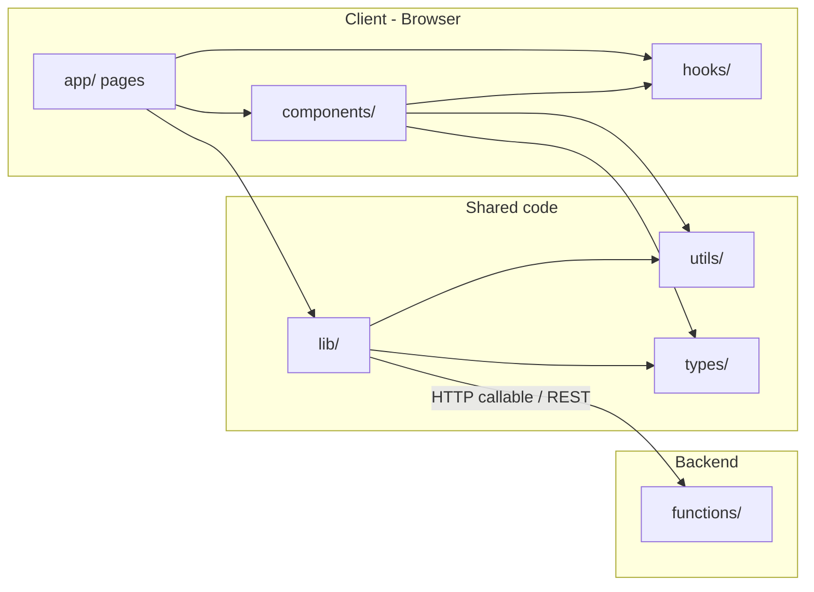
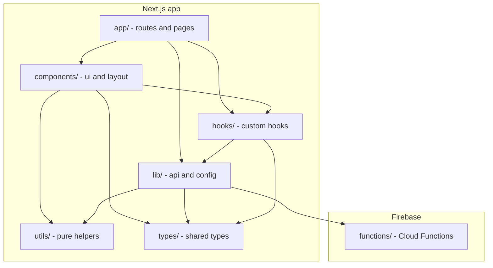

# App skeleton flow and structure

This document describes the **Dorm AI** application skeleton: how folders fit together, what each section contains (including Firebase Functions), and how React concepts like components and hooks work in a Next.js App Router setup.

---

## 1. High-level application flow



- **User hits a URL** → Next.js matches a route under `app/` (e.g. `app/page.tsx` → `/`, `app/dashboard/page.tsx` → `/dashboard`).
- **Pages** in `app/` render the UI by composing **components** from `components/` and using **hooks** from `hooks/`.
- **Shared logic** lives in `lib/` (API clients, auth, config) and **pure helpers** in `utils/`. Both can use **types** from `types/`.
- **Backend** logic (Firebase callable functions, webhooks, etc.) lives in `functions/`. The frontend talks to it via `lib/api/` or similar.

---

## 2. Folder-by-folder: what each section contains

### `app/` — Routes and page-level UI

**Purpose:** Next.js App Router. Every URL is defined by folders and special files here.

| Contains | Description |
|----------|-------------|
| `layout.tsx` | Root layout (HTML shell, fonts, global wrappers). Wraps every page. |
| `page.tsx` | The page component for that route (e.g. `app/page.tsx` = `/`). |
| `globals.css` | Global styles, Tailwind, CSS variables. |
| `loading.tsx` | Optional loading UI while the page or segment is loading. |
| `error.tsx` | Optional error boundary for that segment. |
| `not-found.tsx` | Optional custom 404 for that segment. |
| Nested folders | Each folder with a `page.tsx` becomes a route segment (e.g. `app/dashboard/page.tsx` → `/dashboard`). |

**Convention:** Keep page files thin. They should mostly import and compose components from `components/` and call into `lib/` or `hooks/` for data and behavior.

---

### `components/` — Reusable React UI

**Purpose:** All reusable React components that render UI. Split by concern:

| Subfolder | Use for |
|-----------|---------|
| `components/ui/` | Small, generic building blocks: buttons, inputs, cards, modals, badges. Usually presentational (receive props, no heavy business logic). |
| `components/layout/` | Layout pieces: header, footer, sidebar, nav, page shell. Often wrap `children` and provide structure. |

**What is a component?**  
A **component** is a function (or class) that returns React elements (JSX). It describes one piece of the UI and can be reused with different props.

- **Presentational component:** Receives data and callbacks via props; focuses on how things look.
- **Container/smart component:** May use hooks, fetch data, and pass it down to presentational components.

Example (conceptual):

```tsx
// components/ui/Button.tsx — presentational
export function Button({ label, onClick }: { label: string; onClick?: () => void }) {
  return <button onClick={onClick}>{label}</button>;
}

// components/layout/Header.tsx — composes UI components
import { Button } from "@/components/ui/Button";
export function Header() {
  return (
    <header>
      <nav>…</nav>
      <Button label="Sign in" />
    </header>
  );
}
```

Pages in `app/` import from `@/components/...` (or relative paths) and compose these components.

---

### `lib/` — Integrations, config, and core logic

**Purpose:** Code that talks to the outside world or holds app-wide configuration and core logic. Not tied to a single route or component.

| Subfolder | Use for |
|-----------|---------|
| `lib/` (root) | Firebase app init, env/config, auth helpers, feature flags. |
| `lib/api/` | API clients: callable Firebase functions, REST clients, server-side fetch helpers used by Server Components or Server Actions. |

**Examples of what lives here:**

- Firebase app initialization and auth helpers.
- Wrappers that call Firebase Callable Functions (those live in `functions/`).
- Server Actions (Next.js) that mutate data or call the backend.
- Third-party SDK setup (e.g. analytics, error tracking).

The frontend (`app/`, `components/`, `hooks/`) should call backend and external services **through** `lib/`, not by scattering fetch logic in pages.

---

### `utils/` — Pure helper functions

**Purpose:** Side-effect-free helpers used across the app: formatting, validation, small calculations, etc.

| Contains | Description |
|----------|-------------|
| Pure functions | No React, no DOM, no fetch. Input → output. Easy to test and reuse in both client and server code. |

**Examples:** date formatting, string truncation, form validation helpers, constants, shallow object merge. Both `lib/` and `components/` can import from `utils/`.

---

### `types/` — Shared TypeScript types

**Purpose:** Shared TypeScript interfaces, types, and enums so the whole app (app, components, lib, utils, hooks, functions if they use TS) uses consistent shapes.

| Contains | Description |
|----------|-------------|
| `.ts` or `.d.ts` files | e.g. `User`, `Room`, `ApiResponse<T>`, enums for status or role. |

Import in any layer: `import type { User } from "@/types/user";`. Keeps API contracts and domain models in one place.

---

### `hooks/` — Custom React hooks

**Purpose:** Reusable React hooks that encapsulate state, side effects, or subscription logic.

**What is a hook?**  
A **hook** is a function whose name starts with `use` and that can call other hooks (e.g. `useState`, `useEffect`). Hooks let you reuse stateful and effectful logic between components without duplicating code.

- **Rules:** Only call hooks at the top level of a component or of another custom hook (no hooks inside loops/conditions).
- **Used in:** Client Components (components with `"use client"`) and other custom hooks. Not in Server Components.

**Examples:**

- `useAuth()` — current user, login/logout.
- `useLocalStorage(key)` — sync state with `localStorage`.
- `useDebounce(value, delay)` — debounced value for search inputs.

Pages and components in `components/` import and use these so that complex logic stays in one place.

---

### `functions/` — Firebase backend (Cloud Functions)

**Purpose:** Server-side code that runs on Firebase (Node.js). Not part of the Next.js bundle; invoked via HTTP, callable SDK, or event triggers.

| Contains | Description |
|----------|-------------|
| `index.js` (or `index.ts`) | Entry point. You export Cloud Functions here (e.g. `onRequest`, `onCall`, `onDocumentWritten`). |
| Additional modules | Optional submodules for different domains (e.g. `auth.js`, `notifications.js`) required from `index.js`. |
| `package.json` | Dependencies for the Functions runtime only (e.g. `firebase-functions`, `firebase-admin`). |

**How it fits in the flow:**

- **Frontend** (e.g. `lib/api/`) calls Firebase Callable Functions with the Firebase SDK, or calls HTTP functions with `fetch`.
- **Functions** run in Google’s cloud: they can read/write Firestore, send emails, call external APIs, and enforce auth/server-side rules.

**Convention:** Keep HTTP/callable handlers thin; put business logic in separate modules inside `functions/` so it’s testable and reusable (e.g. from other triggers like Firestore or Auth events).

---

## 3. Next.js App Router — extra concepts

### File-based routing (recap)

- **Route = folder + `page.tsx`.**  
  `app/page.tsx` → `/`.  
  `app/dashboard/page.tsx` → `/dashboard`.  
  `app/dashboard/settings/page.tsx` → `/dashboard/settings`.
- **Layouts:** A `layout.tsx` in a folder wraps all pages in that folder and below. The root `app/layout.tsx` wraps the whole app.
- **Special files:** `layout.tsx`, `page.tsx`, `loading.tsx`, `error.tsx`, `not-found.tsx` have defined roles; other files in `app/` are not routes (e.g. you can put shared page helpers in `app/_utils/` or similar if you want, or keep helpers in `utils/`).

### Server vs Client Components

- **Server Component (default):** No `"use client"`. Runs only on the server. Can be `async`, can read DB/env, no `useState`/`useEffect`. Use for most pages and static content.
- **Client Component:** Add `"use client"` at the top. Can use hooks, event handlers, browser APIs. Use only where you need interactivity or hooks.

Put `"use client"` on the smallest component that needs it (e.g. a form or a dropdown), and keep the rest of the tree as Server Components so the client bundle stays small.

### Data fetching and backend

- **Server Components:** `async function Page()` and `await fetch(...)` or call into `lib/` that uses server-only APIs (e.g. Firebase Admin in an API route or Server Action).
- **Client:** Use hooks (e.g. from `hooks/`) that call `lib/api/` (e.g. callable functions or fetch to API routes). Prefer loading data on the server when possible; use client fetching for user-driven or real-time updates.

### Imports and path aliases

- Use the `@/` alias (if configured in `tsconfig.json`) for clean imports: `@/components/ui/Button`, `@/lib/api/callable`, `@/types/user`, `@/hooks/useAuth`, `@/utils/format`.

---

## 4. Summary diagram



- **app/** — entry points (routes and pages).
- **components/** — reusable UI; **hooks/** — reusable state/effects.
- **lib/** — backend and integrations; **utils/** — pure helpers; **types/** — shared types.
- **functions/** — server-side logic; frontend reaches it via **lib/** (e.g. `lib/api/`).

For day-to-day Next.js usage (routing, Server/Client, navigation), see [nextjs-basics.md](nextjs-basics.md).
